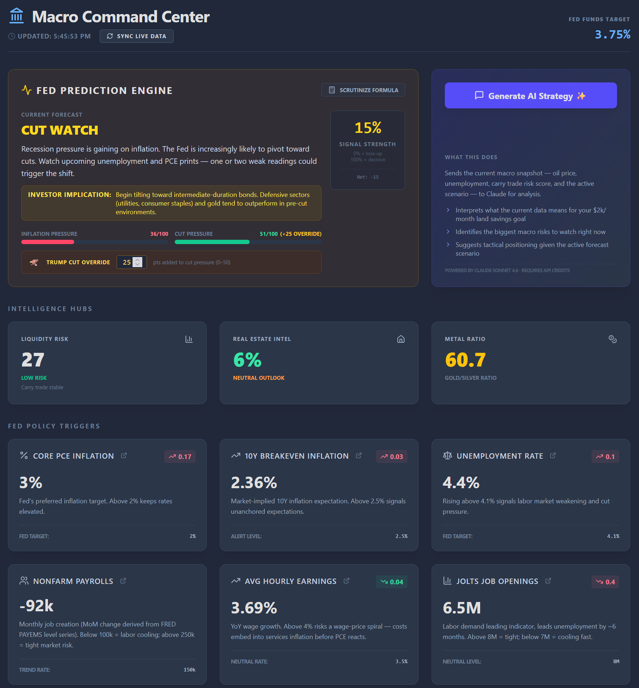

# Macro Command Center

A personal macroeconomic command center for tracking Fed policy signals in real time. Aggregates labor market data, inflation indicators, credit stress, and market sentiment into a single weighted prediction engine — so you can anticipate rate decisions before they happen and position your savings, real estate, and investment allocations accordingly.



## Setup

1. Install dependencies:
   ```bash
   npm install
   ```

2. Create a `.env` file in the project root with the following:
   ```
   VITE_ANTHROPIC_API_KEY=your_anthropic_key_here
   VITE_FRED_API_KEY=your_fred_key_here
   ```
   - **Anthropic key** — get one at [console.anthropic.com](https://console.anthropic.com/). Required for the AI Strategy Analysis button.
   - **FRED key** — get one free at [fred.stlouisfed.org/docs/api/api_key.html](https://fred.stlouisfed.org/docs/api/api_key.html). Required for live macro data (PCE, unemployment, yield curve, jobless claims, etc.). Without it the dashboard runs on cached/default values only.

3. Start the dev server:
   ```bash
   npm run dev
   ```

   Open http://localhost:5174

## How data is fetched

Market data is pulled from two sources on demand via Vite dev-server proxies (to avoid CORS):

- **FRED API** (`api.stlouisfed.org`) — Core PCE, unemployment, yield curve, breakeven inflation, jobless claims, Fed funds rate, 2Y/10Y Treasuries, JOLTS, nonfarm payrolls, avg hourly earnings, consumer inflation expectations, PPI, IG/BBB credit spreads, St. Louis Financial Stress Index, USD/JPY, BOJ rate, Japan 10Y. Requires `VITE_FRED_API_KEY`.
- **Yahoo Finance** (`query1.finance.yahoo.com`) — Brent crude (`BZ=F`), gold (`GC=F`), silver (`SI=F`), S&P 500 (`^GSPC`), DXY (`DX-Y.NYB`), Gladstone Land (`LAND`), Sun Communities (`SUI`).

Data is fetched in parallel using `Promise.allSettled` so a single failing source doesn't block the rest. Results are cached in `localStorage` and persist across page refreshes until the next sync.

## Features

- **Live Data Sync** — Fetches 27+ data points from FRED and Yahoo Finance on load and on demand
- **Fed Prediction Engine** — Two-sided weighted scoring model (inflation pressure vs. cut pressure) forecasting Fed policy scenarios; includes a manual political override input
- **AI Strategy Analysis** — Sends the current macro snapshot to Claude for narrative interpretation and tactical positioning advice
- **Carry Trade Monitor** — Tracks JPY carry trade unwind risk across 6 sub-metrics
- **Credit Markets** — IG OAS, BBB spread, and St. Louis FSI as public proxies for private credit stress
- **Real Estate Intel** — Mortgage rates, AZ land prices, Gladstone Land, Sun Communities
- **Metals Ratio** — Gold/silver spot prices and ratio

## Tech Stack

- React 18 + Vite
- Tailwind CSS
- Lucide React icons
- FRED API (St. Louis Fed)
- Yahoo Finance v8 API
- Claude API (claude-sonnet-4-6)

> **Disclaimer:** See [DISCLAIMER.md](./DISCLAIMER.md) for legal notices.
